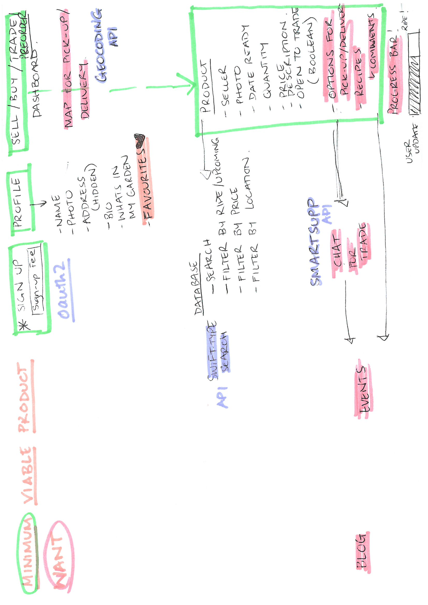

## T2A3 - Marketplace App
Developer: Cassandra Zara (CodeIRL)

## The Agora

*R7* **Problem the app endeavours to solve**

Online marketplaces allow customers to shop whenever they like and access specific desired goods. This marketplace application seeks to solve the problem of food waste and limited space for gardening in the city by encouraging customers to sell and share fresh produce and homecooked meals. It seeks to encourage social connections in a local suburb, with the same benefits of a community farmer's market via social cohesion, a healthy lifestyle approach to diet and sustainable and seasonal buying practices around fresh produce. By creating an online marketplace for a long embedded social practice (farmer's market) it allows neighbors to share their culture via food as well as reduce waste of a single product by ideally, having a 'shared backyard garden', in the inner city. 

*R8* **Why is this a problem?**

With the rise of deliver to door food services, there is even more mental distance from the way food is produced and bought. Fresh fruit and vegetables, as well as home-cooked meals, are an important part of a healthy-lifestyle but can be out of reach for some people, as evidenced through the rise of meal-kit companies like Hello Fresh.  Space for gardening, especially for edible plants, is also limited in the inner-city. Work is ever more shift-based around the weekend, meaning that people can't always get to farmer's markets, or have an opportunity to make social connections with the people who inhabit the same area as them. It is also an opportunity for people who are occupied with unpaid work in terms of family-caring or can't engage in traditional work arrangements to sell goods and build up a regular customer-base from their own home. 

*R9* **Link to deployed application**

https://powerful-sea-24287.herokuapp.com/

Test users for log-in: 
Sally | s@test.com password: password
Jaden | j@test.com password: password123
Chris | c@test.com password: password123
Lucy  | l@test.com password: password123

*R10* **Link to GitHub Repository**

https://github.com/czara804/produce_market

*R11*

**Purpose**

The purpose of the 'Agora' Marketplace app is to provide an online 'Farmer's Market' for a suburb with the idea that each neighbour can be a micro-farmer and produce a type of fruit/vegetable/meal/preserve to sell. Shipping is not handled by the application but rather via contact between users with the listed option of delivery or pickup on each product. Users can buy and sell products. 

**Functionality**

Viewers (pre authentication) can:
- reach the splash page
- View the marketplace
- See extra details about products 
- Can read the 'About' page
- Can sign-up

Users (once authenticated) have the same functionality as viewers, and in addition, are able to:
- Sign in 
- View their profile dashboard
- Edit user details 
- Cancel account
- View products available in the marketplace
- Can search for products by name
- Add products to a private wishlist, which can be viewed on their user profile dashboard 
- Can remove products from their wishlist
- Add products to their cart (and remove them) 
- Can buy via online payment using 'Stripe' integration
- Can view receipts of products bought, including seller contact details
- Users can add products to sell via the 'Contribute' link in the navigation bar or from their profile using a form
- Users can edit their products via form from the marketplace or profile dashboard
- Users can delete their products from the marketplace
- Users can view their sold products (no longer available) from their dashboard
- Users can sign out

**Sitemap**

Note: The sitemap links to the functionality listed above, and once viewers wish to buy or add a product must sign up to receive full functionality and access. The profile dashboard is accessed by clicking the user name in the navigation bar. Upon making an account, the user is routed to the profile where they can add account details such as name, bio and a profile picture. The navigation bar allows direct access to the 'Market', 'Contribute' (Add), 'Basket' (Cart) and the 'About us' page. Users sign out via the profile page. 

**Screenshots**

**Target Audience**

The target audience consists of customers interested in buying local and home-made produce and products, as well as those looking to supplement income/work from home. The age bracket is relatively large in this aspect but is targeted towards those who prefer an online marketplace as their time to attend events may be restricted due to other comminttments. 

**Tech Stack**

The 'Agora' app makes use of the following software and products. 

- HTML
- CSS
- Ruby
- Ruby on Rails
- AWS S3 Storage
- Stripe
- Heroku
- Devise

*R12* 
**User Stories**

Initial/Rough User stories and planning

The graphic below shows the user stories for the app, with mimimum viable product achieved by this deadline. The user story can be read vertically from the customer and then the user stories below each 'epic' umbrella. 

For example:
As a buyer, I want to sign in, to see what meals are available in my suburb. 
As a buyer, I want to search products, to be able to find fresh fruit. 
As a buyer, I want to wishlist products, so I can find them at a later time.
As a viewer, I want to look at what Agora does, before I commit to signing up. 
As a seller, I want to see what I have sold, to know what to make more of. 

https://app.cardboardit.com/maps/110472

*R13* 
**Wireframes**

Rough inital wireframes - see below for refined wireframes

Mobile View

Screen View

*R14* (R17, R18 covered below)
**Entity Relationship Diagram**

*R17* **Active Record Associations**

The Product was the first table implemented and is the main component of the application. 
- It has a picture uploaded by the user that is connect to the product via has_one_attached :photo
- The product belongs_to the user, who is known as the seller
- The product can belong to many wishlists and therefore it's association is has_many wishlist_products, with a dependency to destroy any associated wishlist_products if the product is destroyed or no longer available. 
- Similarly the product can be in many carts via a has_many cart-items association, until it is purchased and becomes no longer available. 
- The product has_one order, as the individual product listing is removed once bought (inventory was beyond the scope of the current project). 

The user is an integral component of the application, as once authenticated, is granted a greater amount of access and functionality. 

- The user can sell many products and thus has_many products, which are dependent on the user and destroyed if the user cancels their account. 
- The user has_one_attached for an image that is used in their profile to personalise user experience. 
- The user has_many wishlist_products, but only one instance of particular product can be added to the wishlist (cannot be added multiple times). 
- The user has_one cart and has_many cart_items through this association. Cart-items are cleared from the cart once purchased. The cart is created upon creation of a user and can only be accessed once this occurs. 
- The user has many orders, as each order links to an individual product and each product has a seller. 

The wishlist products are accessed via the devise action current_user as 

- The wishlist products belongs_to the user who has wishlisted the item
and 
- The wishlist product belongs_to the product it is associated with

It also has the conditional scope of only being a wishlist product if the product is it associated with is available (a boolean attribute of product). 

The Cart plays an important role in purchases online. 
 
 - The cart belongs_to the individual user and remains constant despite the number of, or lack of, items in it. 
 - The cart can have a varying number of items associated with it, and thus has_many cart-items. 

 The cart-item is made to purchase a particualr product.

 - The cart-item therefore belongs_to the cart and can be removed from the cart without affecting the product. 
 - The cart-item is associated with a particular product and these tables are joined so that a cart-item is created only if the product is available and when purchased, the product boolean: available, is changed to false. 

 Once a product is purchased, it is connected to an order. 

 - The order has a belongs_to association with user, as the user who has purchased the product. 
 - The order belongs_to the product that was purchased as an individual order (like a receipt) is create for each individual product. The user who sold the product is still associated with the product and information about the seller can be accessed via this association. 

*R18* **Database relations**

The database has many relations, where a relation is a set of tuples where each element is a member of the defined domains. The attributes of each relation will be discussed below. Refer to the ERD for the visual diagram indicating each attribute and data type. 

The Users relation was implemented with Devise for authentication purposes. It consists of a primary key which is a serial id which is used as a foreign key in other relations within the database. The devise attributes of encyrpted password, reset password token, reset password token sent at and remember created at are a part of this relation. The User has string fields for firstname and lastname, which are seperated so they could be used individually with the first name in the public domain. The user also has a bio, which is a text field to allow a longer description. This attribute would be used more extensively in later releases that incorporate a public profile, and social interactions with other users. 

The Products relation includes a string field for name, which cannot be empty. It has a date attribute with the date data type so users can list products that will be ready at a future date as opposed to the day listed. It has a foreign key that links to the User relation primary key, so the product is related to the user that created it. Integer fields are used for price and quantity, and with the current scope of the application, these values are used the AUD$, and kg as the set unit. In later releases, or with more time, separate relations could be made for currency and metric unit and linked back to the product. A text field is used for the description attribute to allow elaboration upon the product by the seller as currently there is not an option for commenting (future release feature). The product has a boolean value attribute of 'available' that is utilised to identify whether a product has been sold. The delivery option attribute has pre-selected options of 'delivery', 'pickup' or 'either' to allow the seller to designate which is their preferred option. 

The cart relation is essentially a link table that has a primary key id, with and a foreign key for the user. The cart-items has a primary key id, a foreign key for the cart which connects the cart-items to the user, and foreign keys for the product the cart-item is linked to. 

The order relation is designed as a receipt system for a product/cart-item. It has a primary key id, with foreign keys for the user id of the buyer and the product. The foreign key for product is important as it is used to change the boolean available on the original product. It also has a status with data type of string which could be utilized in future releases with shipping for non-perishable items to define pending, shipped and received status. 

The wishlist_products relation has a primary key id, and a foreign key to user to attach to the current user wishlist, as well a foreign to the desired product. 

R19 - Database Schema Design

The application utilizes a postgres database, aligned to work with the deployment platform: Heroku. 

The database design for this application was scaled down to reach the minimum viable product by the deadline, but initially was designed to include further social interaction in the app such as tables for 'events' linked to the user with multiple users attending events, 'recipes' attached to products, and 'comments' attached to products. The current database has tables for User, Products, Wishlist Products, Cart, Cart Items, and Order. The Schema can be seen below, which indicates the groups in each table and foreign keys to other tables within the database. 

*R15* **High level components and abstractions**

Routes
The application defines routes using the rails resources helper for products which encapsulates the preset routes including GET, POST, PATCH and DELETE actions. Custom routes were made for the user profile and payments, as well as devise for the user so the user would have necessary authentication to access all routes. The resources helper was used for wishlist products and cart items with each having a custom route to add a product to either the wishlist or cart. 

Controllers
The controller plays an important role in querying and acessing information in the database and feeding this to the views. 

The products controller follows the CRUD template, in that it contained methods for the index to view all products, show to see an individual product, new and edit that are GET actions to render a view for input, and create and update which POST to save the changes to the database. The product controller contains the method for destruction of a product, and access to a product is permitted through private methods with an added layer of protection. The controller also defines authorization and authentication for particular actions which allows a signed in user to access full functionality but only be able to have full editing access over their own products. 

As the incoporation of devise for authentication controls the processes for log-in, the main controller for the user was the profile controller. The profile controller consists of actions that allow access to the products connected to the current user and permit access to the user details. The profile dashboard also displays the user wishlist. The actions of the wishlist are defined by the wishlist products controller. The Wishlist products controller has methods to show the wishlist items for the current user, checks if the product is already in the wishlist for the current user before creation, and a method to remove a product from the wishlist without affecting the original product. 

The Cart-items controller is vital in the integration of the payment system 'Stripe'. The index method of the cart-items controller allows access to the current users cart, whether it has cart-items or not, and initiates a session for Stripe so payments can be made. Stripe then handles the user payment information and processes the payment externally, which then reroutes to the payments controller in the application. 

Views
The views are rendered in the browser to the user in response to a HTTP request. It is important to consider user experience when designing and deciding what information will be allowed to be rendered, and this access from data in the model, to the view in the browser in mediated by the Controller. Views are built with HTML and ERB and styled with CSS/SCSS. Careful consideration of what data is shown on each page and conditional statements dependent on authorization are programmed in the view files. 
A view will correspond to an action in the controller and a defined route. Partials have been been used to implement DRY code for adding and editing a product. As this code is highly similar, a form partial was created, and rendered in the individual view with any differing code. 

Models
The model is a layer of abstraction from the database. Models allow access to the postgreSQL database in which data is stored. In this application there are models for Product, User, Wishlist Product, Cart, Cart Item and Order which each correspond to a relation in the database. 

*R16* **Third party services**

Stripe
Stripe has been integrated into the application as a merchant that can handle and store credit card information with PCI compliance. This minimizes the risk associated with a data breach when there has been collection of user payment information. Stripe acts as a payment gateway and was integrated via the Stripe gem, using the API keys associated with the developer account. The API keys are stored in an encrypted credentials file within the rails application to allow access. The Agora app makes use of the Stripe Checkout, where the user is redirected to the Stripe website to make a payment and once completed is redirected back to the app. A new Stripe session is created each time a purchase is made and this is managed through the cart-items controller and cart/basket page. Stripe redirects to particular pages depending on whether the payment has been successful or cancelled. 

Heroku
Heroku is a container-based cloud platform (PaaS), that has been used for deployment of the app. The deployment platform handles the server, hardware and infrastructure side of hosting the app, with the code being updated by being pushed to Heroku via Git repository. A postgreSQL database was used to work in association with Heroku. 

AWS
Amazon Web Services has been used in the app for cloud storage of images. The Amazon S3 service (Amazon Simple Storage Service) is used to store the user uploaded images for product and user, as they can be accessed via url from a pre-created bucket. Rails ActiveStorage is set up to use images stored in S3, with encrypted credentials to allow access. Though the current iteration of the application uses S3 primarily for storage of images, it offers scalability, security and performance advantages for future releases that could include greater incorporation of data. An advantage of A3 is it's approach to data durability, "because it automatically creates and stores copies of all S3 objects across multiple systems which means data is available when needed and protected against failures, errors, and threats" (Amazon, 2020). The assets pipeline has been used for styling with static images on the web application. 

Cloud Object Storage | Store & Retrieve Data Anywhere | Amazon Simple Storage Service (S3). (2020). Amazon Web Services, Inc.. Retrieved 13 March 2020, from https://aws.amazon.com/s3/

*R20* **Trello**

Tasks were allocated and tracked using 'Trello' during the development process. Initial requirements were listed and then a plan prioritising features and functionality was made. Daily lists with goals were also made on paper, an example of which is below. 

Trello Screenshots

